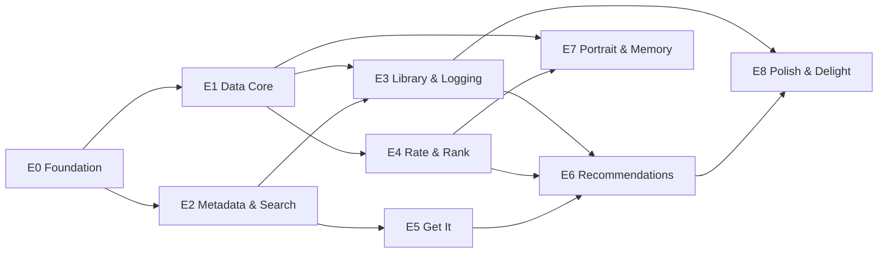
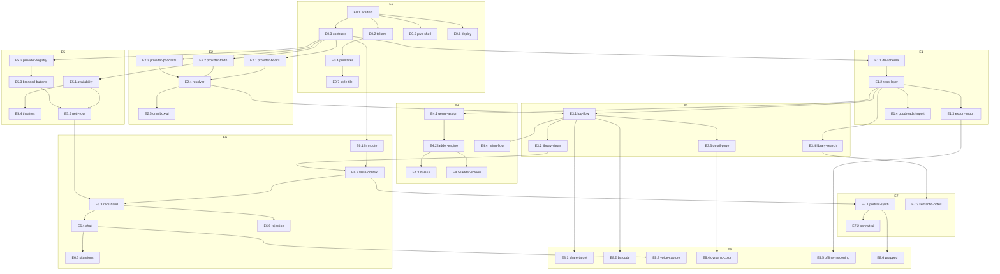

# Nightstand — Epics & Bead Graph

The unit of work is a **bead**: small enough for one subagent to complete in one sitting,
with explicit **dependencies** (`deps`), testable **acceptance criteria** (`AC`), and an
exclusive **file footprint** (`owns`) — the set of paths only that bead may touch while
in flight. Non-overlapping footprints are what let subagents build in parallel without
colliding; the protocol around them is in [`COORDINATION.md`](./COORDINATION.md).

**Status legend:** `todo` → `claimed` → `in-progress` → `review` → `done`.
All beads start `todo`. Status lives here, in this file — single source of truth.

---

## Epic map

Critical path: **E0 → E1 → E3 → E6**. E2 runs parallel to E1; E4 and E5 run parallel to
E3; E7 parallel to E6.

---

## Bead dependency graph

---

## E0 — Foundation

### E0.1 `scaffold` — Next.js app skeleton
- **deps:** none · **owns:** repo root configs, `app/layout.tsx`, `app/page.tsx`
- **AC:**
  - [ ] `npm run dev`, `build`, `lint`, `test` all pass clean on a fresh clone
  - [ ] TypeScript strict; App Router; Tailwind v4 wired
  - [ ] Vitest + Playwright configured with one passing smoke test each

### E0.2 `tokens` — design tokens
- **deps:** E0.1 · **owns:** `styles/tokens.css`, `tailwind` theme config
- **AC:**
  - [ ] Ink-and-lamplight palette as CSS custom properties; dark default, warm light mode
  - [ ] Serif display face + neutral sans, loaded locally, `font-display: swap`
  - [ ] Spacing/radius/type scales; zero raw hex values anywhere outside this file

### E0.3 `contracts` — shared TypeScript contracts ⚠️ blocks almost everything
- **deps:** E0.1 · **owns:** `lib/types/*.ts`
- **AC:**
  - [ ] Types for `Item`, `Entry`, `Comparison`, `QueueItem`, `Situation`, `Availability`,
        `Rec`, `Portrait`, `Genre`, `RatingMode` matching PLAN §8's sketch
  - [ ] Provider-neutral `MediaRef` (medium + external ids) used by every provider module
  - [ ] Zod schemas alongside types; exported from a single barrel

### E0.4 `primitives` — component library
- **deps:** E0.2 · **owns:** `components/ui/*`
- **AC:**
  - [ ] Button, Chip, Card, Sheet, Input, Tabs, Rating gradient, safe-area TabBar
  - [ ] Storybook-style demo route rendering every primitive in both themes
  - [ ] Tap targets ≥ 44px; visible focus states; passes an axe scan

### E0.5 `pwa-shell` — installable PWA
- **deps:** E0.1 · **owns:** `app/manifest.ts`, `public/icons/*`, service-worker setup
- **AC:**
  - [ ] Installable on iOS/Android (manifest + icons + SW); Lighthouse PWA pass
  - [ ] App shell cached; offline reload renders UI, not the dino
  - [ ] `share_target` declared in manifest (handler lands in E8.1)

### E0.6 `deploy` — pipeline
- **deps:** E0.1 · **owns:** `vercel.json`, GitHub Actions workflow
- **AC:**
  - [ ] Push to branch → preview URL; merge to main → production, via Vercel connector
  - [ ] CI runs lint + typecheck + tests on every PR; red CI blocks merge
  - [ ] Env vars documented in `.env.example` (never committed with values)

### E0.7 `style-tile` — the agreement screen
- **deps:** E0.4 · **owns:** `app/style/page.tsx`
- **AC:**
  - [ ] One real screen: cover-forward card, serif titles, action row mock, both themes
  - [ ] Reviewed by Jeremy before any E3+ UI bead starts — this is a hard gate

## E1 — Data Core

### E1.1 `db-schema` — Dexie database
- **deps:** E0.3 · **owns:** `lib/db/schema.ts`, `lib/db/index.ts`
- **AC:**
  - [ ] Tables per PLAN §8 sketch with indexes for every query pattern in E3/E4/E6
  - [ ] Versioned migrations proven by a v1→v2 test
  - [ ] Fake-IndexedDB test suite green

### E1.2 `repo-layer` — typed data access
- **deps:** E1.1 · **owns:** `lib/db/repo/*.ts`
- **AC:**
  - [ ] All reads/writes go through repo functions; UI never imports Dexie directly
  - [ ] Live queries (`useLiveQuery`) for reactive views
  - [ ] Unit tests for every repo function, including edge cases (dup adds, missing ids)

### E1.3 `export-import` — backup
- **deps:** E1.2 · **owns:** `lib/backup/*`, `app/settings/backup/*`
- **AC:**
  - [ ] One-tap export of the full DB to versioned JSON via share sheet
  - [ ] Import restores a fresh install to identical state (round-trip test)
  - [ ] Import validates with Zod and refuses corrupt files with a human message

### E1.4 `goodreads-import` — seed from the CSV
- **deps:** E1.2 · **owns:** `lib/import/goodreads.ts`, `data/` fixtures
- **AC:**
  - [ ] All 225 rows parse; ratings, shelves, dates, ISBNs land in the right fields
  - [ ] ≥95% of ISBN13 rows resolve to canonical items with covers
  - [ ] Rating-mode inference marks the nostalgia cluster per TASTE-BASELINE Finding 3
  - [ ] Unresolved rows queue for one-tap manual match, never silently dropped

## E2 — Metadata & Search

### E2.1 `provider-books` / E2.2 `provider-tmdb` / E2.3 `provider-podcasts`
- **deps:** E0.3 (each independent of the others) · **owns:** `app/api/providers/<name>/*`, `lib/providers/<name>.ts`
- **AC (each):**
  - [ ] Stateless API route proxying search + detail; keys server-side only
  - [ ] Normalizes to `MediaRef`/`Item` contract; response cached (LRU + HTTP headers)
  - [ ] Graceful degradation: provider down → typed error, UI-safe
  - [ ] *tmdb only:* watch-providers (US) + `now_playing` endpoints included
  - [ ] *podcasts only:* resolves Spotify show URL + Apple Podcasts URL per show

### E2.4 `resolver` — cross-provider identity
- **deps:** E2.1–E2.3 · **owns:** `lib/resolve/*`
- **AC:**
  - [ ] One `resolve(query)` returns grouped, deduped results across all four media
  - [ ] ISBN→item and title+author fallback both covered by tests
  - [ ] Same real-world title from two providers dedupes to one item

### E2.5 `omnibox-ui` — the Find-it surface
- **deps:** E2.4 · **owns:** `components/omnibox/*`, `app/search/*`
- **AC:**
  - [ ] One field, results grouped by medium, cover-forward, <150ms perceived (optimistic + debounced)
  - [ ] Two-scope layout per PLAN §4.6: "Your library" section above "Everything"
  - [ ] Tap → detail page; long-press → quick-log without leaving results

## E3 — Library & Logging

### E3.1 `log-flow` — add/track/finish
- **deps:** E1.2, E2.4 · **owns:** `lib/actions/log.ts`, `components/log/*`
- **AC:**
  - [ ] Add-to-stack, start, finish, abandon — each ≤2 taps from search or detail
  - [ ] Optimistic writes; queueing offline works (verified airplane-mode test)
  - [ ] Finish triggers rating flow (E4.4) without blocking navigation

### E3.2 `library-views` — the Library tab
- **deps:** E3.1 · **owns:** `app/library/*`
- **AC:**
  - [ ] Cover grid + list toggle, remembered per medium; **your rating always visible**
  - [ ] Segments: On the nightstand / The stack / The drawer; filter by medium & genre
  - [ ] 225-item library scrolls at 60fps on a mid-tier phone (virtualized)

### E3.3 `detail-page` — the item page
- **deps:** E3.1 · **owns:** `app/item/[id]/*`
- **AC:**
  - [ ] Cover/poster is the hero; subtitle demoted per PLAN §2 teardown
  - [ ] Your data (rating, dates, tags, note) above community data
  - [ ] Rating-distribution verdict line ("this one splits people") where data exists
  - [ ] Get-it row slot present (filled by E5.5)

### E3.4 `library-search` — the Where-is-it scope
- **deps:** E1.2 · **owns:** `lib/search/local.ts`
- **AC:**
  - [ ] Instant local search over titles, authors, tags, notes (no network)
  - [ ] Powers the "Your library" scope in the omnibox
  - [ ] Semantic-search hook point exposed for E7.3

## E4 — Rate & Rank

### E4.1 `genre-assign` — automatic genre
- **deps:** E1.2 · **owns:** `lib/genre/*`
- **AC:**
  - [ ] Every item auto-assigned to one of the 8 ladders from metadata; no user taxonomy
  - [ ] Spot-check fixture: ≥90% of the 225 seed books land where TASTE-BASELINE says
  - [ ] Manual override persists and never gets clobbered by re-import

### E4.2 `ladder-engine` — Elo core
- **deps:** E4.1 · **owns:** `lib/ladder/*`
- **AC:**
  - [ ] Pairwise update math with per-genre pools; comfort pool isolated per decision
  - [ ] Next-duel selection maximizes information (adjacent scores, crowded 4–5 band first)
  - [ ] Property-based tests: transitivity tendency, bounded scores, no cross-genre duels

### E4.3 `duel-ui` — the ten-second question
- **deps:** E4.2 · **owns:** `components/duel/*`
- **AC:**
  - [ ] Two covers, one tap, next pair; skip always available; never more than 3 in a row
  - [ ] Appears at natural moments (post-rating, app-open) — never a nag
  - [ ] Feels good: shared-element motion, haptic on choice

### E4.4 `rating-flow` — gradient + tags + mode
- **deps:** E3.1 · **owns:** `components/rating/*`
- **AC:**
  - [ ] Loved/liked/fine/no in one tap; taste-tag chips (≤4, contextual) optional second tap
  - [ ] Mode (admired/enjoyed/comfort) inferred, shown as a subtle editable chip
  - [ ] Whole flow ≤5 seconds; skippable at every step

### E4.5 `ladder-screen` — the ranked view
- **deps:** E4.2 · **owns:** `app/library/ladder/*`
- **AC:**
  - [ ] Per-genre ranked list, drag-to-correct writes a comparison
  - [ ] Confidence shown honestly (few duels → wide bands, not fake precision)

## E5 — Get It

### E5.1 `availability` — where can I watch/read/hear it
- **deps:** E2.2 · **owns:** `lib/availability/*`
- **AC:**
  - [ ] Per-item availability across the 10 subscribed services; sub vs rent vs buy distinguished
  - [ ] **In-theaters state** from `now_playing`; cached 24h with visible staleness
  - [ ] "On something I pay for" boolean exposed to the recommender (E6)

### E5.2 `provider-registry` — one source of truth for services
- **deps:** E0.3 · **owns:** `lib/providers/registry.ts`, `public/brands/*`
- **AC:**
  - [ ] Registry entry per service: id, name, brand colors, logo asset, deep-link template
  - [ ] Official logos bundled locally, sourced from each service's brand/press kit,
        with a `BRANDS.md` noting source + guideline constraints per mark
  - [ ] Adding a service = one registry entry + one asset, nothing else

### E5.3 `branded-buttons` — the ProviderButton
- **deps:** E5.2 · **owns:** `components/provider-button/*`
- **AC:**
  - [ ] One component renders any registry service with correct logo, color, clear-space
  - [ ] Meets each brand's minimum-size and contrast rules in both themes
  - [ ] Deep links open the native app when installed, web fallback otherwise (iOS tested)

### E5.4 `theaters` — Fandango showtimes
- **deps:** E5.1 · **owns:** `lib/availability/theaters.ts`, zip-code setting
- **AC:**
  - [ ] Theatrical titles show a Fandango button deep-linking to that title's showtimes
  - [ ] Zip stored once in settings; optional geolocation with permission prompt
  - [ ] Recommendations tab exposes a "movies in theaters now" chip fed by `now_playing`

### E5.5 `getit-row` — assembly
- **deps:** E5.1, E5.3 · **owns:** `components/getit-row/*`
- **AC:**
  - [ ] Detail pages and rec cards show the row: subscribed sources first, then rent/buy,
        then theaters; Kindle/Audible for books; Spotify-first for podcasts
  - [ ] Empty state is honest: "not streamable right now" + best alternative
  - [ ] Every rendered link verified non-404 by a fixture test across 20 known titles

## E6 — Recommendations

One engine, three entry points (PLAN §4.4): the default **hand** of picks, **situation
chips**, and **chat**. All three share the taste context, availability constraints, and
rejection capture.

### E6.1 `llm-route` — the intelligence endpoint
- **deps:** E0.3 · **owns:** `app/api/recommend/*`, `lib/llm/*`
- **AC:**
  - [ ] Streaming route wrapping Anthropic API; passphrase header enforced; keys server-side
  - [ ] Tool-use schema lets the model query availability and the library summary
  - [ ] Serves both modes: one-shot hand generation and multi-turn chat
  - [ ] Cost guard: request budget cap + graceful "thinking too hard" fallback

### E6.2 `taste-context` — the engine's briefing
- **deps:** E6.1, E3.2 · **owns:** `lib/llm/context.ts`
- **AC:**
  - [ ] Compact library summary (ladder standings, tags, rejections, modes) ≤4k tokens
        at 500 items; deterministic; unit-tested against the seed corpus
  - [ ] Comfort titles excluded from signal unless situation requests comfort
  - [ ] Rejection history included with reasons

### E6.3 `recs-hand` — the default offer
- **deps:** E6.2, E5.5 · **owns:** `app/recommendations/page.tsx`, `components/rec-card/*`
- **AC:**
  - [ ] Opening the tab shows a pre-dealt hand: 3–5 picks **spanning media types**, each
        with a one-line reason citing your history and a Get-it row
  - [ ] Queue-first: stack items that fit lead the hand
  - [ ] Hand refreshes when the model learns (new rating, rejection, finish) — never on a
        timer; last hand cached for instant open and offline display
  - [ ] Cold-start behavior defined: with seed data only, hand is books-weighted and says so

### E6.4 `chat` — the ask-in-your-own-words entry
- **deps:** E6.3 · **owns:** `app/recommendations/chat/*`, `components/chat/*`
- **AC:**
  - [ ] One tap from the Recommendations tab into a freeform conversation
  - [ ] Situation in, 3–5 recs out, streaming, same rec-card component as the hand
  - [ ] Follow-ups refine in context ("shorter", "funnier", "in theaters instead")
  - [ ] A good chat answer is saveable as a situation chip (feeds E6.5)

### E6.5 `situations` — saved openings
- **deps:** E6.4 · **owns:** `components/situations/*`
- **AC:**
  - [ ] Chip row on the tab incl. "45 min before bed", "long flight", "movies in theaters
        now"; tapping deals a hand for that situation without opening chat
  - [ ] Custom situations saveable from any chat; reuse tracks what worked

### E6.6 `rejection` — the flywheel
- **deps:** E6.3 · **owns:** `components/rejection/*`, repo hooks
- **AC:**
  - [ ] Every rec card — hand, chip, or chat — dismissible with one-tap reason
        (incl. "can't get it", "seen it")
  - [ ] Rejections persist and demonstrably alter the next session's `taste-context`
  - [ ] Test: reject 3 long books → next "before bed" ask surfaces nothing >400 pages

## E7 — Portrait & Memory

### E7.1 `portrait-synth` — the taste model, written down
- **deps:** E6.2 · **owns:** `lib/portrait/*`
- **AC:**
  - [ ] Opus synthesis of axes, obsessions, blind spots, seasonality from live data
  - [ ] Versioned; refresh on app-open ≥7 days stale; manual corrections stored and
        honored by every subsequent synthesis
  - [ ] Assigned-canon calibration question asked exactly once, answer respected

### E7.2 `portrait-ui` — the page
- **deps:** E7.1 · **owns:** `app/portrait/*`
- **AC:**
  - [ ] Beautiful enough to screenshot (design gate with Jeremy, like E0.7)
  - [ ] Every claim carries thumbs-down → correction flow
  - [ ] States observations, never scolds (copy review is part of AC)

### E7.3 `semantic-notes` — memory search
- **deps:** E3.4 · **owns:** `lib/search/semantic.ts`
- **AC:**
  - [ ] "The one with the lighthouse keeper" finds the right item from notes/metadata
  - [ ] Works through the E4.6 two-scope search field; graceful without network

## E8 — Polish & Delight

### E8.1 `share-target` (deps E3.1) — shared URL/text from any app lands in Inbox, auto-resolves; unresolved shares never lost
### E8.2 `barcode` (deps E3.1) — ISBN scan → detail in <3s
### E8.3 `voice-capture` (deps E6.4) — "finished Bear s3, four stars…" parses to a full logged entry
### E8.4 `dynamic-color` (deps E3.3) — accent extracted from artwork per detail page, both themes safe
### E8.5 `offline-hardening` (deps E1.3) — full offline pass: every read works, every write queues; airplane-mode e2e
### E8.6 `wrapped` (deps E7.1) — year-in-review from real data; screenshot-worthy

---

## Sequencing at a glance

| Wave | Beads running in parallel |
|---|---|
| 1 | E0.1 |
| 2 | E0.2, E0.3, E0.5, E0.6 |
| 3 | E0.4, E1.1, E2.1, E2.2, E2.3, E5.2, E6.1 |
| 4 | E0.7 🚦, E1.2, E2.4, E5.3 |
| 5 | E1.3, E1.4, E2.5, E3.1*, E3.4, E4.1, E5.1 |
| 6 | E3.2, E3.3, E4.2, E4.4, E5.4, E5.5 |
| 7 | E4.3, E4.5, E6.2 |
| 8 | E6.3 → E6.4 → E6.5, E6.6, E7.1 |
| 9 | E7.2, E7.3, E8.* |

🚦 = human gate: **E0.7 (style tile) needs Jeremy's sign-off before wave-6 UI beads run.**
\* E3.1 starts when both E1.2 and E2.4 land.
